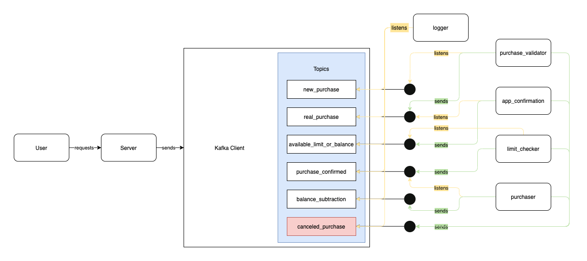

# creditmodel.clj

A Clojure package used to simulate e credit card system model with clients cards.
The package counts with Datomic database to store the data and Cloure as
the main language. Also, a Kafka Client is used to establish communication between the 
services.<br>
The package is able to create clients, add cards to the created clients and check
the purchases made by the clients. <br>
Below we can see the diagram of the communication system of the project.<br>



## Usage

```clojure
;; in collection under :dependencies key
[br.com.marinho/creditmodel "0.1.0"]
```

## Authors

Gabriel Marinho