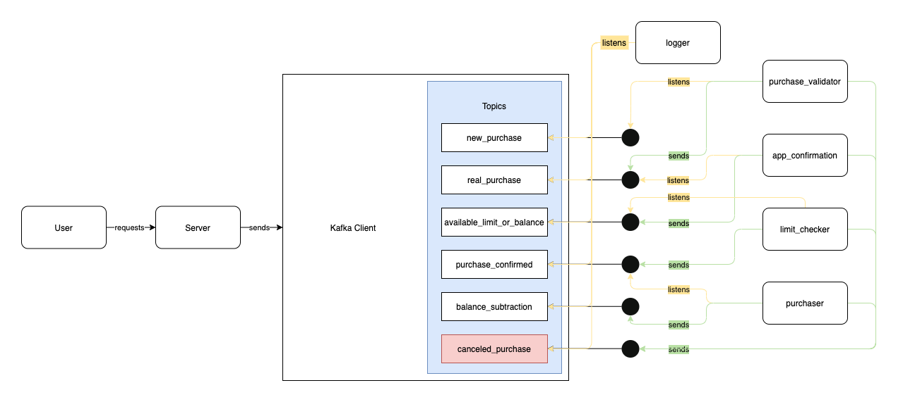

# communication.clj module

The `communication.clj` module is responsible for having the basic structure needed to 
establish a communication between the services. It has two main files that can be used 
by those services to **send** and **consume**  messages: the `producer.clj` and 
`consumer.clj` files. 

## The structure

The structure of the communication process of the project is quite simple. As we can 
see in the picture below.

The beginning of the process happens with a user making a request to the server, of a 
new purchasing operation. Then, the server sends this message to the **Kafka client**, 
who has a list of topics. Inside this list, there is a topic called *new_purchase*, 
that happens when the user makes this request. Also, we have *real_purchase*, 
*available_limit_or_balance*, *purchase_confirmed*, *balance_subtraction* and 
*canceled_purchase* topics to help us in the process.

## Services
1. **Logger** is the service responsible for listening **EVERY** topic. It's a utility 
   service used to show us all information about what's happening within the other 
   services.
2. **PurchaseValidator** is an important service, used to validate whether the 
   purchase is valid or not, making possible to proceed with the purchasing or to 
   cancel the purchase operation.
3. The **AppConfirmation** service is the one that, after validating the purchase 
   operation, enables the purchase in the system. In other words, it proceeds with the 
   purchasing, already knowing that it's a valid one. However, if the confirmation 
   does not happen or ir the purchase is not confirmed, the service send a message to 
   the **CanceledPurchase** topic.
4. After confirming the purchasing, the **LimitChecker** service is responsible for 
   checking is there is available limit or balance in the account to proceed with the 
   operation. If there is not, a message is sent to the **CanceledPurchase** topic.
5. The final step is at the **Purchaser** service, the responsible for making the 
   purchase after all validations. Important to say that if there is a problem with 
   the purchasing finishing, the service send a message to the **CanceledPurchase** topic.